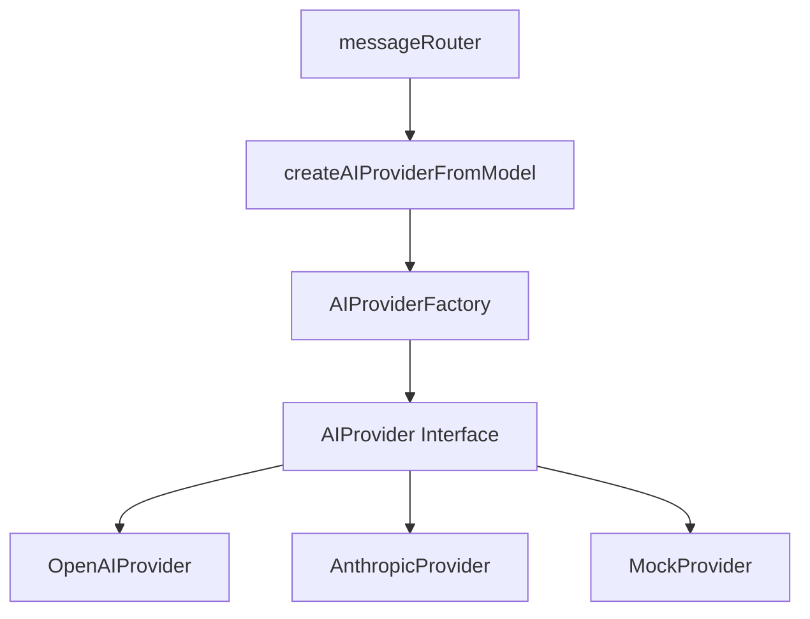

# AI Providers System Documentation

## Overview

The AI Providers system provides a unified abstraction layer for integrating multiple AI/LLM providers (OpenAI, Anthropic, etc.) in the Tea4Chat application. This system enables seamless switching between different AI providers while maintaining consistent interfaces for both streaming and non-streaming responses.

## Architecture

### Core Components



### Key Features

- **Unified Interface**: All providers implement the same `AIProvider` interface
- **Streaming Support**: Real-time response streaming for all providers
- **Factory Pattern**: Easy provider creation and registration
- **Error Handling**: Consistent error handling across providers
- **Mock Provider**: Testing and development support
- **Type Safety**: Full TypeScript support with strict typing

## Core Interfaces

### AIProvider Interface

```typescript
interface AIProvider {
  readonly name: string;
  readonly model: string;
  readonly supportedModels: string[];

  // Non-streaming methods
  generateResponse(messages: AIMessage[], config?: Partial<AIProviderConfig>): Promise<AIResponse>;

  // Streaming methods
  streamResponse(messages: AIMessage[], config?: Partial<AIProviderConfig>): AsyncIterable<AIStreamChunk>;

  // Utility methods
  validateConfig(config: AIProviderConfig): boolean;
  estimateTokens(messages: AIMessage[]): number;
}
```

### Message Types

```typescript
interface AIMessage {
  role: "user" | "assistant" | "system";
  content: string;
}

interface AIStreamChunk {
  content: string;
  isComplete: boolean;
  metadata?: {
    model?: string;
    provider?: string;
    tokenCount?: number;
  };
}

interface AIResponse {
  content: string;
  metadata: {
    model: string;
    provider: string;
    tokenCount?: number;
    finishReason?: string;
  };
}
```

## Supported Providers

### 1. OpenAI Provider

**Supported Models:**
- `gpt-4`
- `gpt-4-turbo`
- `gpt-4o`
- `gpt-4o-mini`
- `gpt-3.5-turbo`
- `gpt-3.5-turbo-16k`

**Configuration:**
- Requires valid OpenAI API key
- Default model: `gpt-4o`
- Max tokens: 4096
- Temperature: 0.7

### 2. Anthropic Provider

**Supported Models:**
- `claude-3-5-sonnet-20241022`
- `claude-3-5-haiku-20241022`
- `claude-3-opus-20240229`
- `claude-3-sonnet-20240229`
- `claude-3-haiku-20240307`

**Configuration:**
- Requires valid Anthropic API key
- Default model: `claude-3-5-sonnet-20241022`
- Max tokens: 4096
- Temperature: 0.7

### 3. Mock Provider

**Supported Models:**
- `mock-fast` - Quick responses (50ms between words)
- `mock-slow` - Slow responses (500ms between words)
- `mock-verbose` - Longer responses
- `mock-concise` - Shorter responses
- `mock-creative` - Creative word selection

**Use Cases:**
- Development and testing
- UI/UX testing without API costs
- Demonstrating streaming behavior

## Usage Examples

### Basic Provider Creation

```typescript
import { createAIProvider, AIProviderConfig } from './lib/ai-providers';

// Create OpenAI provider
const openaiProvider = createAIProvider('openai', {
  apiKey: process.env.OPENAI_API_KEY!,
  model: 'gpt-4o',
  maxTokens: 4096,
  temperature: 0.7
});

// Create Anthropic provider
const anthropicProvider = createAIProvider('anthropic', {
  apiKey: process.env.ANTHROPIC_API_KEY!,
  model: 'claude-3-5-sonnet-20241022',
  maxTokens: 4096,
  temperature: 0.7
});
```

### Using createAIProviderFromModel (Recommended)

```typescript
import { createAIProviderFromModel } from './lib/ai-providers';

// Create provider from database model and user settings
const provider = createAIProviderFromModel(
  { provider: 'openai', name: 'gpt-4o' },
  { openaiApiKey: 'user_api_key', anthropicApiKey: null },
  { temperature: 0.8, maxTokens: 2048 } // optional overrides
);
```

### Non-Streaming Response

```typescript
const messages = [
  { role: 'user', content: 'Hello, how are you?' }
];

const response = await provider.generateResponse(messages);
console.log(response.content);
console.log(response.metadata);
```

### Streaming Response

```typescript
const messages = [
  { role: 'user', content: 'Write a short story about AI.' }
];

for await (const chunk of provider.streamResponse(messages)) {
  if (chunk.content && !chunk.isComplete) {
    process.stdout.write(chunk.content);
  }
  
  if (chunk.isComplete) {
    console.log('\n--- Stream Complete ---');
    break;
  }
}
```

### Using in tRPC (messageRouter.ts)

```typescript
// Create AI provider
const aiProvider = createAIProviderFromModel(
  modelToUse,
  ownerSettings || { openaiApiKey: null, anthropicApiKey: null },
  {
    maxTokens: 4096,
    temperature: 0.7,
  }
);

// Convert conversation history
const aiMessages: AIMessage[] = conversationHistory
  .filter(msg => msg.content && msg.content.trim().length > 0)
  .map(msg => ({
    role: msg.role as "user" | "assistant",
    content: msg.content.trim(),
  }));

// Stream the response
for await (const chunk of aiProvider.streamResponse(aiMessages)) {
  if (chunk.content && !chunk.isComplete) {
    fullContent += chunk.content;
    emit({
      type: "aiMessageChunk",
      messageId: aiMessage.id,
      chunk: chunk.content,
      chatId: chatId,
    });
  }

  if (chunk.isComplete) {
    break;
  }
}
```

## Factory Pattern

### AIProviderFactory

The factory provides centralized provider management:

```typescript
import { AIProviderFactory } from './lib/ai-providers';

// Get available providers
const providers = AIProviderFactory.getAvailableProviders();
// ['openai', 'anthropic', 'mock']

// Get supported models for a provider
const models = AIProviderFactory.getSupportedModels('openai');
// ['gpt-4', 'gpt-4-turbo', 'gpt-4o', ...]

// Create provider instance
const provider = AIProviderFactory.createProvider('openai', config);
```

### Registering Custom Providers

```typescript
class CustomProvider implements AIProvider {
  readonly name = "custom";
  readonly model = "custom-model";
  readonly supportedModels = ["custom-model"];

  // Implement required methods...
}

// Register the custom provider
AIProviderFactory.registerProvider("custom", CustomProvider);
```

## Error Handling

### Common Error Types

```typescript
// API Key errors
throw new Error(`${providerName} API key not configured or invalid`);

// Rate limiting
throw new Error('Rate limit exceeded. Please try again later.');

// Quota exceeded
throw new Error('Quota exceeded. Please check your billing.');

// Provider unavailable
throw new Error(`${providerName} service is currently unavailable`);
```

### Provider-Specific Error Handling

The system automatically converts provider-specific errors into standardized formats:

```typescript
// In messageRouter.ts
if (errorMessage.includes('API key') || errorMessage.includes('unauthorized')) {
  error(new TRPCError({
    code: 'UNAUTHORIZED',
    message: `${providerName} API key not configured or invalid.`,
    cause: { errorCode: ErrorCode.API_KEY_INVALID, provider: providerName }
  }));
}
```

## Configuration

### Provider Configuration

```typescript
interface AIProviderConfig {
  apiKey: string;
  model: string;
  maxTokens?: number;        // Default: 4096
  temperature?: number;      // Default: 0.7
  timeout?: number;          // Default: 30000ms
}
```

### Environment Variables

```bash
# OpenAI
OPENAI_API_KEY=your_openai_api_key

# Anthropic
ANTHROPIC_API_KEY=your_anthropic_api_key
```

### User Settings (Database)

```typescript
// ownerSettings table
{
  ownerId: string;
  openaiApiKey?: string;
  anthropicApiKey?: string;
}
```

## Testing with Mock Provider

### Development Testing

```typescript
// Use mock provider for development
const mockProvider = createAIProvider('mock', {
  apiKey: 'not-needed',
  model: 'mock-fast'
});

// Test streaming behavior
for await (const chunk of mockProvider.streamResponse(messages)) {
  console.log('Mock chunk:', chunk.content);
}
```

### Model Variations

```typescript
// Fast responses for quick testing
const fastMock = createAIProvider('mock', { model: 'mock-fast' });

// Slow responses to test loading states
const slowMock = createAIProvider('mock', { model: 'mock-slow' });

// Verbose responses for UI testing
const verboseMock = createAIProvider('mock', { model: 'mock-verbose' });
```

## Performance Considerations

### Token Estimation

```typescript
const tokenCount = provider.estimateTokens(messages);
console.log(`Estimated tokens: ${tokenCount}`);
```

### Streaming vs Non-Streaming

- **Streaming**: Better UX for real-time responses, lower perceived latency
- **Non-Streaming**: Better for batch processing, simpler error handling

### Configuration Optimization

```typescript
// For faster responses
const config = {
  maxTokens: 1024,
  temperature: 0.3
};

// For more creative responses
const config = {
  maxTokens: 4096,
  temperature: 0.9
};
```

## Integration Points

### 1. Message Router (`messageRouter.ts`)

Primary integration point for chat functionality:

```typescript
// Create provider from user's model preference
const aiProvider = createAIProviderFromModel(modelToUse, ownerSettings, config);

// Stream response to client
for await (const chunk of aiProvider.streamResponse(aiMessages)) {
  // Handle streaming chunks
}
```

### 2. Database Models (`prisma/schema.prisma`)

```prisma
model ModelCatalog {
  id       String @id @default(cuid())
  provider String // 'openai', 'anthropic', 'mock'
  name     String // Model name
  // ... other fields
}

model OwnerSettings {
  ownerId         String  @id
  openaiApiKey    String?
  anthropicApiKey String?
  // ... other fields
}
```

### 3. Frontend Integration

The providers work seamlessly with the existing tRPC streaming setup:

```typescript
// Frontend (React/tRPC)
const { mutate } = trpc.message.sendWithStream.useMutation({
  onSuccess: (data) => {
    // Stream chunks received automatically
  }
});
```

## Extending the System

### Adding New Providers

1. **Implement AIProvider interface**:
```typescript
class NewProvider implements AIProvider {
  readonly name = "newprovider";
  readonly model = "new-model";
  readonly supportedModels = ["new-model"];

  // Implement all required methods
}
```

2. **Register with factory**:
```typescript
AIProviderFactory.registerProvider("newprovider", NewProvider);
```

3. **Update database seed** (`prisma/seed.ts`):
```typescript
// Add new models to ModelCatalog
```

### Custom Configurations

```typescript
// Add custom config options
interface CustomConfig extends AIProviderConfig {
  customOption?: string;
}

class CustomProvider implements AIProvider {
  constructor(config: CustomConfig) {
    // Handle custom configuration
  }
}
```

## Best Practices

### 1. Error Handling
- Always handle API key validation
- Provide meaningful error messages
- Use structured error codes

### 2. Configuration Management
- Use environment variables for defaults
- Allow user-specific API keys
- Validate configurations before use

### 3. Testing
- Use mock provider for development
- Test all streaming scenarios
- Validate error handling paths

### 4. Performance
- Estimate tokens before requests
- Use appropriate timeouts
- Consider rate limiting

### 5. Security
- Never log API keys
- Validate user permissions
- Use secure storage for keys

## Troubleshooting

### Common Issues

1. **"API key not configured"**
   - Check environment variables
   - Verify user settings in database
   - Ensure API key is valid

2. **"Model not found"**
   - Check supportedModels array
   - Verify model name spelling
   - Update model catalog in database

3. **Streaming stops unexpectedly**
   - Check abort signal handling
   - Verify timeout settings
   - Monitor network connectivity

4. **Rate limiting errors**
   - Implement retry logic
   - Check API usage limits
   - Consider request queuing

### Debug Tips

```typescript
// Enable debug logging
console.log(`Using ${provider.name} with model ${provider.model}`);
console.log(`Estimated tokens: ${provider.estimateTokens(messages)}`);

// Test provider validation
if (!provider.validateConfig(config)) {
  console.error('Invalid provider configuration');
}
```

## Future Enhancements

### Planned Features

1. **Request Queuing**: Handle rate limits automatically
2. **Response Caching**: Cache responses for duplicate requests
3. **Model Fallbacks**: Automatic fallback to alternative models
4. **Usage Analytics**: Track token usage and costs
5. **Custom Providers**: Plugin system for third-party providers

### Architecture Improvements

1. **Dependency Injection**: More flexible provider management
2. **Event System**: Provider lifecycle events
3. **Middleware**: Request/response transformation
4. **Monitoring**: Performance and error tracking

---

## Related Files

- **Implementation**: `server/src/lib/ai-providers.ts`
- **Usage**: `server/src/router/messageRouter.ts`
- **Database**: `server/prisma/schema.prisma`
- **Seeding**: `server/prisma/seed.ts`
- **Tests**: `server/src/tests/` (if applicable)

For more information, see the source code and inline documentation in the implementation files. 