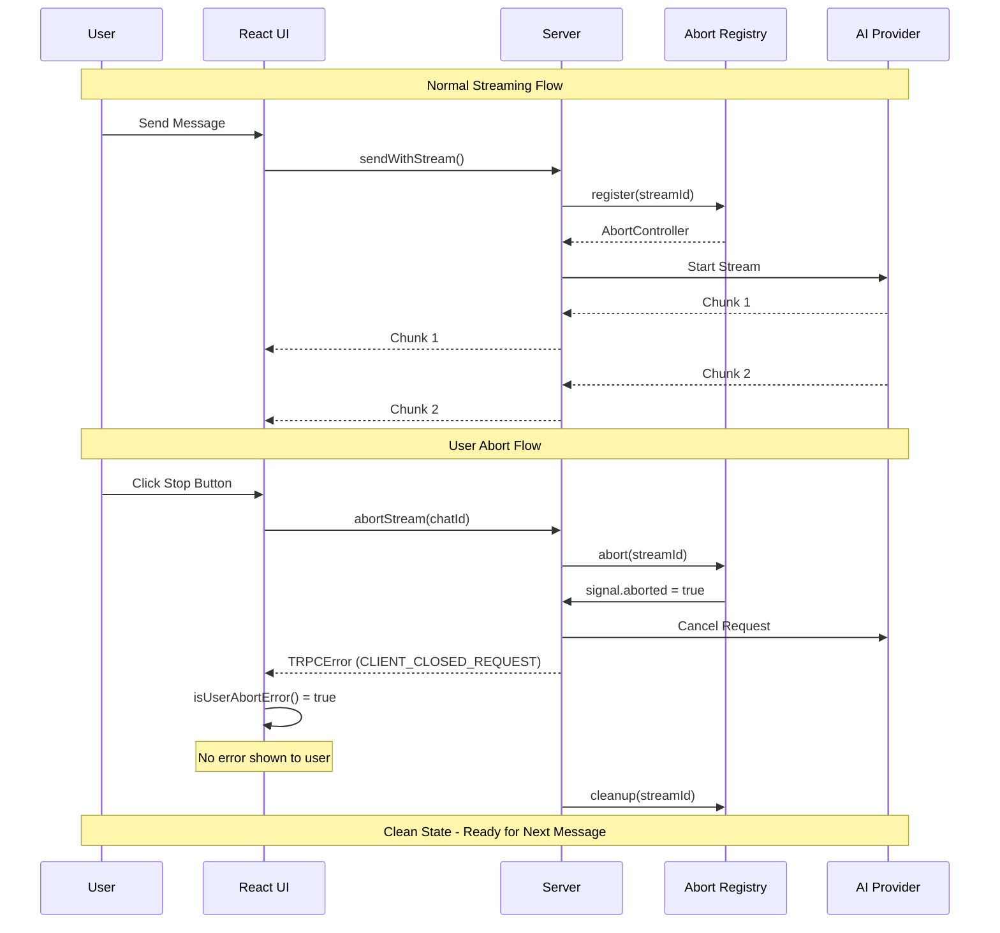

# Stream Abort Mechanism

## 🛑 Overview

The Stream Abort Mechanism provides a robust way for users to gracefully stop AI response streaming in real-time. When a user clicks the "Stop" button during streaming, the system immediately aborts the ongoing operation without showing error messages to the user.

## 🎯 Key Features

✅ **Graceful Termination**: Streams stop immediately when requested  
✅ **Clean UX**: No error messages shown for user-initiated aborts  
✅ **Type-Safe**: Centralized error handling without type casting  
✅ **Server Cleanup**: Automatic resource cleanup on abort  
✅ **Multi-Provider**: Works with OpenAI, Anthropic, and future providers  

## 🏗️ Architecture

```
┌─────────────────┐    ┌──────────────────┐    ┌─────────────────┐
│     Client      │    │      Server      │    │  AI Provider    │
│                 │    │                  │    │                 │
│ [Stop] Button   │───►│ AbortController  │───►│ Stream Cancel   │
│                 │    │                  │    │                 │
│ Error Filter    │◄───│ Abort Registry   │    │                 │
│ (No UI Error)   │    │ (Cleanup)        │    │                 │
└─────────────────┘    └──────────────────┘    └─────────────────┘
```

## 🔧 Implementation Flow

### Sequence Diagram



### 1. Stream Registration
```typescript
// When streaming starts, register with abort registry
const streamId = createStreamId(chatId, ownerId);
const abortController = streamAbortRegistry.register(streamId);
```

### 2. User Abort Request
```typescript
// User clicks stop button → UI calls abort
const abortResult = await trpc.message.abortStream.mutate({ chatId });
```

### 3. Server-Side Abort
```typescript
// Server finds and aborts the stream
const wasAborted = streamAbortRegistry.abort(streamId);
abortController.abort(); // Triggers AbortSignal
```

### 4. Stream Process Termination
```typescript
// Stream checks abort signal during processing
if (abortController.signal.aborted) {
  error(new TRPCError({
    code: 'CLIENT_CLOSED_REQUEST',
    message: STREAM_ERROR_MESSAGES.ABORTED_DURING_PROCESSING
  }));
  return;
}
```

### 5. Clean Error Handling
```typescript
// UI filters out user-initiated abort errors
if (!isUserAbortError(err)) {
  error(`Failed to process stream: ${err.message}`);
}
```

## 📁 File Structure

### Core Components

#### **Server Side**
- **`server/src/lib/stream-abort-registry.ts`** - Central registry for active streams
- **`server/src/lib/errors.ts`** - Shared error definitions and utilities
- **`server/src/router/messageRouter.ts`** - Abort endpoint and stream handling

#### **Client Side**  
- **`ui/src/hooks/useChatMessages.ts`** - React hook with abort support
- **`ui/src/components/ChatTextForm/ChatTextForm.tsx`** - UI with stop button

### Shared Definitions
- **`ErrorCode.CLIENT_CLOSED_REQUEST`** - Standard abort error code
- **`STREAM_ERROR_MESSAGES`** - Centralized error messages
- **`isUserAbortError()`** - Type-safe error detection utility

## 🚀 Usage Examples

### Basic Abort Implementation

```typescript
// In your React component
const { sendMessage, abortStream, isSending } = useChatMessages({
  chatId,
  onChatCreated: ({ chatId }) => navigate(`/chat/${chatId}`)
});

// Send message
const handleSend = () => {
  sendMessage("Hello AI!", modelId);
};

// Abort stream
const handleAbort = () => {
  abortStream(); // Stops current stream
};

// UI with conditional button
<IconButton onClick={isSending ? handleAbort : handleSend}>
  {isSending ? <StopIcon /> : <SendIcon />}
</IconButton>
```

### Advanced Error Handling

```typescript
// Custom error handler that respects abort logic
const sendMessageMutation = trpc.message.sendWithStream.useMutation({
  onSuccess: async (streamGenerator) => {
    try {
      for await (const chunk of streamGenerator) {
        handleStreamingUpdate(chunk);
      }
    } catch (err) {
      // Clean error handling - no type casting needed!
      if (!isUserAbortError(err)) {
        notifyError(`Stream failed: ${err.message}`);
      }
      // User aborts are silently handled
    }
  }
});
```

### Server-Side Stream Protection

```typescript
// Protect long-running operations with abort checks
const streamAIResponse = async ({ emit, error }: IsolatedIteratorCallbacks) => {
  // Check before starting
  if (abortController.signal.aborted) {
    error(new TRPCError({
      code: 'CLIENT_CLOSED_REQUEST',
      message: STREAM_ERROR_MESSAGES.ABORTED_BEFORE_START
    }));
    return;
  }

  // Stream AI response
  for await (const chunk of aiStream) {
    // Check during processing
    if (abortController.signal.aborted) {
      error(new TRPCError({
        code: 'CLIENT_CLOSED_REQUEST', 
        message: STREAM_ERROR_MESSAGES.ABORTED_DURING_PROCESSING
      }));
      return;
    }
    
    emit({ type: "chunk", data: chunk });
  }
};
```

## 🔍 Error Code Reference

### Abort-Related Error Codes

```typescript
export enum ErrorCode {
  CLIENT_CLOSED_REQUEST = 'CLIENT_CLOSED_REQUEST', // User initiated abort
  STREAM_ABORTED = 'STREAM_ABORTED',               // General stream abort
}

export const STREAM_ERROR_MESSAGES = {
  ABORTED_BEFORE_START: 'Stream was aborted before starting',
  ABORTED_DURING_PROCESSING: 'Stream was aborted', 
  CLIENT_DISCONNECTED: 'Client disconnected',
} as const;
```

### Error Detection Utility

```typescript
// Type-safe error detection without casting
export function isUserAbortError(error: unknown): boolean {
  if (error && typeof error === 'object') {
    // Check error code
    if ('code' in error && error.code === ErrorCode.CLIENT_CLOSED_REQUEST) {
      return true;
    }
    
    // Check error message patterns
    if ('message' in error) {
      const message = String(error.message);
      return message.includes('CLIENT_CLOSED_REQUEST') || 
             message.includes('Stream was aborted') ||
             Object.values(STREAM_ERROR_MESSAGES).some(msg => message.includes(msg));
    }
  }
  
  return false;
}
```

## 🎮 Testing the Abort Mechanism

### Manual Testing Steps

1. **Start a Chat**: Navigate to a chat and send a message
2. **Abort During Streaming**: Click the stop button while AI is responding  
3. **Verify Clean Stop**: Stream should stop without error notifications
4. **Check Logs**: Server logs should show "Stream aborted successfully"
5. **Resume Normal Operation**: Send another message to verify system recovery

### Debugging Active Streams

```typescript
// Check active streams for debugging
const activeStreams = await trpc.message.getActiveStreams.query();
console.log('Active streams:', activeStreams);

// Manual abort for testing
const result = await trpc.message.abortStream.mutate({ 
  chatId: "test-chat-id" 
});
console.log('Abort result:', result.success);
```

## 🛠️ Advanced Configuration

### Custom Abort Timeouts

```typescript
// Extend StreamAbortRegistry with timeout support
class EnhancedStreamAbortRegistry extends StreamAbortRegistry {
  registerWithTimeout(streamId: string, timeoutMs: number = 30000) {
    const controller = this.register(streamId);
    
    // Auto-abort after timeout
    setTimeout(() => {
      if (!controller.signal.aborted) {
        console.log(`Auto-aborting stream ${streamId} after timeout`);
        this.abort(streamId);
      }
    }, timeoutMs);
    
    return controller;
  }
}
```

### Custom Error Messages

```typescript
// Extend error messages for specific use cases
export const CUSTOM_STREAM_MESSAGES = {
  ...STREAM_ERROR_MESSAGES,
  USER_REQUESTED_STOP: 'User requested to stop generation',
  NETWORK_INTERRUPTED: 'Network connection interrupted',
  RATE_LIMIT_ABORT: 'Aborted due to rate limiting',
} as const;
```

## 🚨 Best Practices

### ✅ Do's
- Always check `abortController.signal.aborted` before expensive operations
- Use `isUserAbortError()` for consistent error detection  
- Register streams immediately when starting
- Clean up resources in `finally` blocks
- Provide clear visual feedback (stop button vs send button)

### ❌ Don'ts  
- Don't use type casting for error handling
- Don't show error messages for user-initiated aborts
- Don't forget to cleanup registered streams
- Don't block the UI while aborting
- Don't assume streams will always complete naturally

## 🔗 Related Documentation

- **[Event Sourcing Streams](./event-sourcing-streams.md)** - Advanced streaming patterns
- **[Stream Controller](./stream-controller.md)** - High-level streaming interface  
- **[Router Documentation](../server/src/router/README.md)** - tRPC router setup

## 📈 Performance Considerations

- **Registry Overhead**: Minimal - uses Map for O(1) lookups
- **Memory Usage**: Auto-cleanup prevents memory leaks
- **Network Impact**: Abort requests are lightweight (~100 bytes)
- **AI Provider**: Immediate termination saves API costs
- **Client Performance**: No blocking operations during abort

## 🎯 Future Enhancements

- **Partial Results**: Option to keep partial AI responses on abort
- **Abort Confirmation**: Optional confirmation dialog for long streams  
- **Analytics**: Track abort frequency and patterns
- **Batch Abort**: Abort multiple streams simultaneously
- **Auto-Resume**: Resume from last chunk after accidental abort 